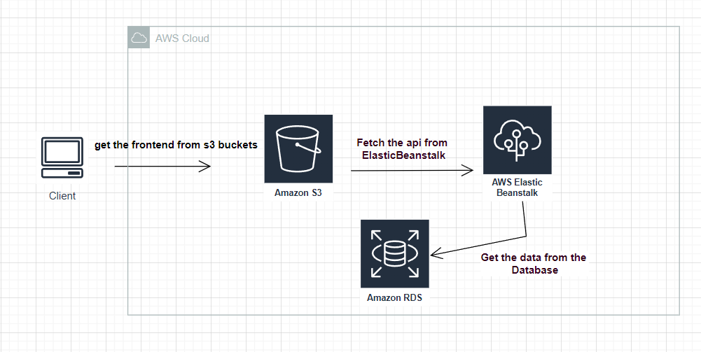

### The Architecture Digram

There are steps to make the infrastructure of our deployment application

## How did the project create?
1. We need to ceate database with RDS provided by aws.

2. We need to create our envirmont with elastic beanstalk which called Host-fullstack-app-env and nodeJs plateform and default region which is us-east-1. 

### We set our enviroment variables through our code

3. Create s3 bucket to put our frontend app.

 ### This is our Bucket policy
***
    {
        "Version": "2012-10-17",
        "Statement": [
            {
                "Sid": "PublicReadGetObject",
                "Effect": "Allow",
                "Principal": "*",
                "Action": [
                    "s3:GetObject",
                    "s3:PutObject",
                    "s3:PutObjectAcl"
                ],
                "Resource": "arn:aws:s3:::host-fullstack-app/*"
            }
        ]
    }

4. After we test our deployment application we connect our project to my circleCi account, CircleCi execute the config.yml file in .circleci .

